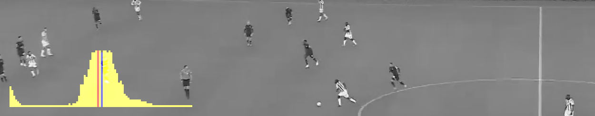
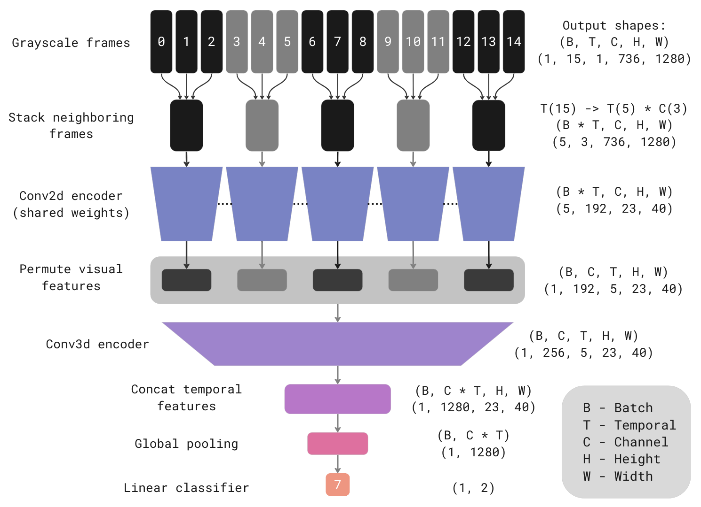
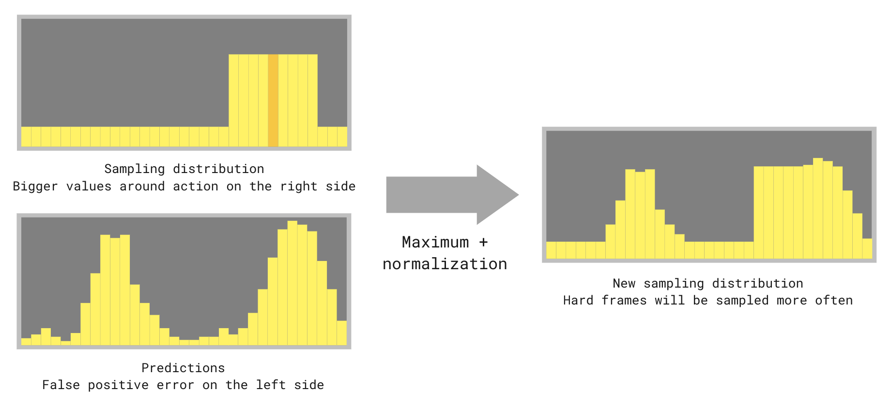

# Solution for SoccerNet Ball Action Spotting Challenge 2023



This repo contains the 1st place solution for the [SoccerNet Ball Action Spotting Challenge 2023](https://www.soccer-net.org/challenges/2023#h.vverf0niv2is).
The challenge goal is to develop an algorithm for spotting passes and drives occurring in videos of soccer matches.
Unlike the [SoccerNet Action Spotting Challenge](https://www.soccer-net.org/challenges/2023#h.x9nb4u9m441u), the actions are much more densely allocated and should be predicted more accurately (with a 1-second precision).

## Solution

Key points:
* Efficient model architecture for extracting information from video data
* Multi-stage training (transfer learning, fine-tuning with long sequences)
* Fast video loading for training (GPU based, no need for preprocessing with extracting images)

### Model

The model architecture employed in this solution utilizes a slow fusion approach, incorporating 2D convolutions in the early stages and 3D convolutions in the later stages.
This architectural choice made one of the most significant contributions to the overall metric outcome.
It effectively improved the mAP@1 metric on both the test and challenge sets, resulting in an approximate increase of 15% (from 65% to 80%) compared to an approach utilizing 2D CNN early fusion.



The model consumes sequences of grayscale frames. Neighboring frames are stacking as channels for input to the 2D convolutional encoder.
For example, if fifteen frames are stacked in sets of three, the outcome would be five input tensors, each consisting of three channels.
The shared 2D encoder independently processes these input tensors, producing visual features.
The following 3D encoder processes visual features, producing temporal features.
Concated temporal features pass through global pooling to compress the spatial dimensions.
Then, a linear classifier predicts the presence of actions in the middle frame of the original input sequence.

I choose the following model hyperparameters as a result of the experiments:
* Stack threes from 15 grayscale 1280x736 frames skipping every second frame from the original 25 FPS video (equivalent to 15 neighboring frames at 12.5 FPS, about 1.16 seconds window)
* EfficientNetV2 B0 as 2D encoder
* 4 inverted residual 3D blocks as 3D encoder (ported from 2D EfficientNet version)
* GeM as global pooling
* Multilabel classification with positive labels applied in a 0.6 seconds window (15 frames at 25 FPS) around the action timestamp from annotation

You can find more details in the [model implementation](src/models/multidim_stacker.py) and [experiment configs](configs/ball_action).

### Training

I made several stages of training to obtain 86.47% mAP@1 on the challenge set (87.03% on the test):
1. **Basic training ([config](configs/ball_action/sampling_weights_001.py)).** The 2D encoder is initialized with ImageNet-pre-trained weights; other parts start from scratch.
2. **Training on Action Spotting Challenge dataset ([config](configs/action/action_sampling_weights_002.py)).** Same weights initialization as in the first stage.
3. **Transfer learning ([config](configs/ball_action/ball_tuning_001.py)).** 2D and 3D encoders initialized with weights obtained in the second stage. Out-of-fold predictions from the first stage were used for data sampling (more details later).
4. **Fine-tuning with long sequences ([config](configs/ball_action/ball_finetune_long_004.py)).** 2D and 3D encoders initialized with weights obtained in the third stage. 2D encoder weights are frozen.

#### Basic training

In this challenge, I employed 7-fold cross-validation to tune the training pipeline more precisely.
Each labeled game from the dataset is an individual fold.

In short, the resulting training pipeline hyperparameters are:
* Learning rate warmup for the first 6 epochs from 0 to 3e-4, cosine annealing last 30 epochs to 3e-6
* Batch size 4, one training epoch comprises 6000 samples
* Optimizer AdamW with weight decay 0.01
* Focal loss with gamma 1.2
* Model EMA with decay 0.999
* Initial weights for 2D encoder ImageNet pretrained
* Architecture hyperparameters listed above in the model part

Worth writing about sampling techniques during training, which significantly impacts its results.
For basic training, a simple but well-working sampling algorithm was used.
For each training sample, randomly take a video index from a uniform distribution.
Then randomly choose a frame index with an equal chance to sample frames near to actions and remaining frames.
Frame near to action if allocated in a 0.36 seconds window (9 frames at 25 FPS) around the action.
I tried different ratios, but an equal chance to show empty and event frame worked best.
I will introduce a more advanced sampling scheme in the section on transfer learning.

I applied the usual augmentations like horizontal flip, rotation, random resized crop, brightness, motion blur, etc.
Of the interesting, there are only two temporal augmentations:
* Simulating camera movement (change translation, scale, and angle over time)
* Randomly shake the frames in sequences (applied 40% chance to change the frame index on +- 1)

The models from this training have 79.06% on CV (cross-validation) and 84.26% mAP@1 on the test set (the metric on test split was calculated by the out-of-fold predictions for two folds which include test games).
I did not evaluate these models for the challenge set.

#### Training on Action Spotting Challenge dataset

I built a similar pipeline for videos and classes from Action Spotting Challenge to get good initial weights for the next experiment.

Briefly, here are the changes from the previous:
* 377 games in training, 18 in validation split
* 15 classes (all cards-related class was merged because the model consumes grayscale frames)
* 4 warmup epochs and 20 training epochs, one epoch is 36000 samples
* Weight the frame sampling by the effective number of class samples

#### Transfer learning

This training uses the results of the previous two.
The second one gives excellent initial weights for 2D and 3D encoders. It provides a significant boost (~2% mAP@1 on test and CV).
That is understandable because the same models were trained on many games with similar input frames and some similar actions.

Basic training gives out-of-fold predictions that I use for sampling in the following way:



Take the element-wise maximum between the sampling distribution (introduced above) and predictions, then normalize again to equal probability sums between empty and action frames.
The intuition is that there are some hard negative examples in the dataset. Due to many negative samples, such hard examples are rarely sampled during training.
We can make something like hard negative mining/sampling with the technique.

Other minor changes compared to basic training:
* 7 warmup epochs and 35 training epochs
* Focal loss with gamma 1.2 and alpha 0.4

Models achieve 81.04% on CV, 86.51% on the test, and 86.35% mAP@1 on the challenge set.

#### Fine-tuning with long sequences

Before, I trained all models on relatively short clips (15 frames in 12.5 FPS, 1.16 seconds) to fits the VRAM of a single GPU and to decrease training time. Models obtained good 2D and 3D encoder weights in the previous experiment. So I tried to freeze 2D weights and fine-tune 3D weights on long sequences to provide more context.

Changes compared to transfer learning experiment:
* 33 frames in 12.5 FPS (2.6 seconds)
* LR warmup first 2 epochs from 0 to 1e-3, cosine annealing last 7 epochs to 5e-05
* SGD with Nesterov momentum 0.9

Models scored 80.49% on CV, 87.04% on the test, and 86.47% mAP@1 on the challenge set. The score is lower on cross-validation, but it's my best submission on the test and the challenge set `¯\_(ツ)_/¯`.

### Prediction and postprocessing

Models predict each possible sequence of frames from the videos. Additionally, I make test time augmentation with the horizontal flip. On the challenge set, I used the arithmetic mean of predictions from all fold models.

Postprocessing is very simple. I just used a combination of Gaussian filter and peak detection from `SciPy` with the following parameters: standard deviation for Gaussian kernel 3.0, peak detection minimal height 0.2, and minimal distance between neighboring peaks 15 frames.

### Training and prediction accelerations

I optimized the training pipeline to iterate experiments faster and to test more hypotheses.
* Custom multiprocessing video loader with simultaneous use `VideoProcessingFramework` (GPU decoding) and `OpenCV` (CPU decoding) workers to optimize hardware utilization
* FP16 with Automatic Mixed Precision
* `torch.compile` using TorchDynamo backend
* Augmentation on the GPU with `kornia`

These accelerations allow running epoch (train + val) of basic training in 7 minutes and 10 seconds on a single RTX 3090 Ti.
It is impressive because one epoch is 6000 training and approximately 2600 validation examples, each of which is 15 frames in 1280x736 resolution.
Also, using source videos without the preprocessing with extracting images allows using any video frame during training and saves disk space.

I applied caching strategy to speed up inference time using the architecture structure.
If one saves the last visual features, it is enough to predict with the 2D encoder only one stack of frames when receiving a new one.
The 2D encoder is the most time expensive part of the model. Predicting 3D features takes a short time. So this strategy dramatically boosts prediction speed by several times.

### Progress

You can see detailed progress of the solution development during the challenge in [spreadsheets](https://docs.google.com/spreadsheets/d/1mGnTdrVnhoQ8PJKNN539ZzhZxSowc4GpN9NdyDJlqYo/edit?usp=sharing) (the document consists of multiple sheets).

My solution is very inspired by the top solutions of the DFL - Bundesliga Data Shootout competition:
* Team Hydrogen ([link](https://www.kaggle.com/competitions/dfl-bundesliga-data-shootout/discussion/359932))
* K_mat ([link](https://www.kaggle.com/competitions/dfl-bundesliga-data-shootout/discussion/360097))
* Camaro ([link](https://www.kaggle.com/competitions/dfl-bundesliga-data-shootout/discussion/360236))
* ohkawa3 ([link](https://www.kaggle.com/competitions/dfl-bundesliga-data-shootout/discussion/360331))

So I found a good base approach quickly. Thanks for sharing well-written and detailed reports :)
Thanks to the SoccerNet organizers for the excellent datasets. Thanks to the participants for a good competition. Thanks to my family and friends who supported me during the challenge!

## Quick setup and start

### Requirements

* Linux (tested on Ubuntu 20.04 and 22.04)
* NVIDIA GPU (pipeline tuned for RTX 3090)
* NVIDIA Drivers >= 520, CUDA >= 11.8
* [Docker](https://docs.docker.com/engine/install/)
* [NVIDIA Container Toolkit](https://docs.nvidia.com/datacenter/cloud-native/container-toolkit/install-guide.html)

### Run

Clone the repo and enter the folder.

```bash
git clone git@github.com:lRomul/ball-action-spotting.git
cd ball-action-spotting
```

Build a Docker image and run a container.

<details><summary>Here is a small guide on how to use the provided Makefile</summary>

```bash
make  # stop, build, run

# do the same
make stop
make build
make run

make  # by default all GPUs passed
make GPUS=all  # do the same
make GPUS=none  # without GPUs

make run GPUS=2  # pass the first two GPUs
make run GPUS='\"device=1,2\"'  # pass GPUs numbered 1 and 2

make logs
make exec  # run a new command in a running container
make exec COMMAND="bash"  # do the same
make stop
```

</details>

```bash
make
```

From now on, you should run all commands inside the docker container.

Download the Ball Action Spotting dataset (9 GB).
To get the password, you must fill NDA ([link](https://www.soccer-net.org/data)).

```bash
python download_ball_data.py --password_videos <password>
```

Download the Action Spotting dataset (791.5 GB). You can skip this step, but then you cannot train the model on the action dataset.

```bash
python download_action_data.py --only_train_valid --password_videos <password>
```

Now you can train models and use them to predict games.
To reproduce the final solution, you can use the following commands:

```bash
# Train and predict basic experiment on all folds
python scripts/ball_action/train.py --experiment sampling_weights_001
python scripts/ball_action/predict.py --experiment sampling_weights_001

# Training on Action Spotting Challenge dataset
python scripts/action/train.py --experiment action_sampling_weights_002

# Transfer learning
python scripts/ball_action/train.py --experiment ball_tuning_001

# Fine-tune with long sequences, evaluate on CV, and predict challenge set
python scripts/ball_action/train.py --experiment ball_finetune_long_004
python scripts/ball_action/predict.py --experiment ball_finetune_long_004
python scripts/ball_action/evaluate.py --experiment ball_finetune_long_004
python scripts/ball_action/predict.py --experiment ball_finetune_long_004 --challenge
python scripts/ball_action/ensemble.py --experiments ball_finetune_long_004 --challenge

# Spotting results will be there
cd data/ball_action/predictions/ball_finetune_long_004/challenge/ensemble/
zip results_spotting.zip ./*/*/*/results_spotting.json
```

### Trained models

You can skip any step of training the final solution by downloading model weights and predictions from [Google Drive](https://drive.google.com/drive/folders/1mIu62cIdsRn3W4o1E5vRR8V5Q1B6HHoz?usp=sharing).

Copy the files to the [data](data) directory so that the folder structure is as follows:

```
data
├── action
│   ├── experiments
│   │   └── action_sampling_weights_002
│   └── predictions
│       └── action_sampling_weights_002
├── ball_action
│   ├── experiments
│   │   ├── ball_finetune_long_004
│   │   ├── ball_tuning_001
│   │   └── sampling_weights_001
│   └── predictions
│       ├── ball_finetune_long_004
│       ├── ball_tuning_001
│       └── sampling_weights_001
├── readme_images
└── soccernet
    └── spotting-ball-2023
        └── england_efl
```
